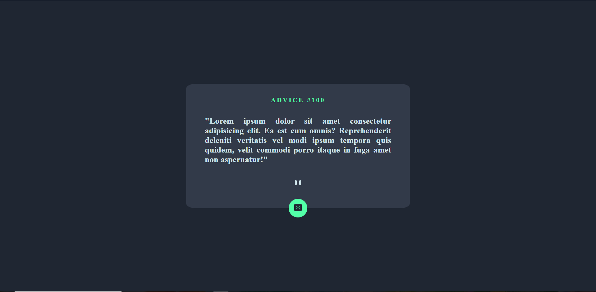
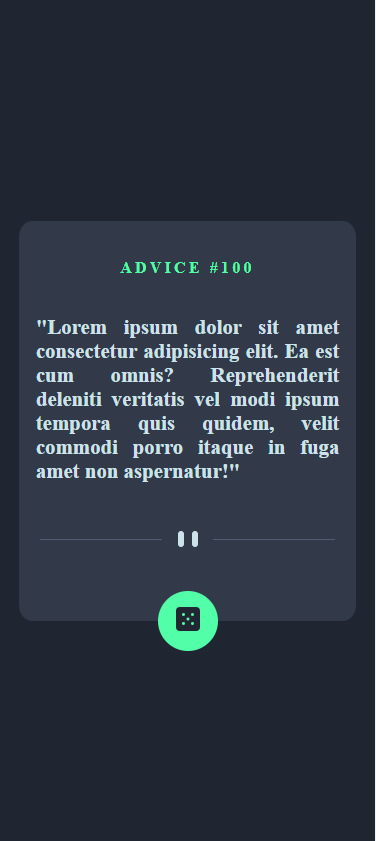

# 🎇Front-End Mentor Project : Advice Generator App

## 📄 Description

The project consists of a single page with a centered box.

This page shows a random advice everytime the user presses the green button on the bottom of the box.

A random advice is also generated if the user refreshes the page.

## 💻 Programming Languages Used

- Html
- Css
- JavaScript

## ❓ How to Use

As mentioned in the description, the user just needs to access the page, then a random advice is automatically showed to them.

If the user wants to see other advices, they just need to press the green button or refresh the page.

## 📸 Screenshots

### Desktop Version

### Mobile Version

## Author: João Francisco Fortes André